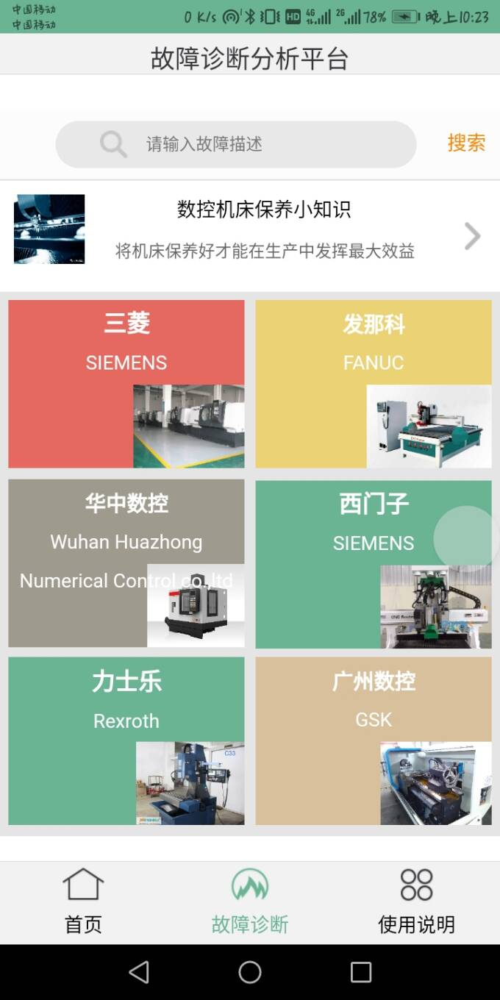
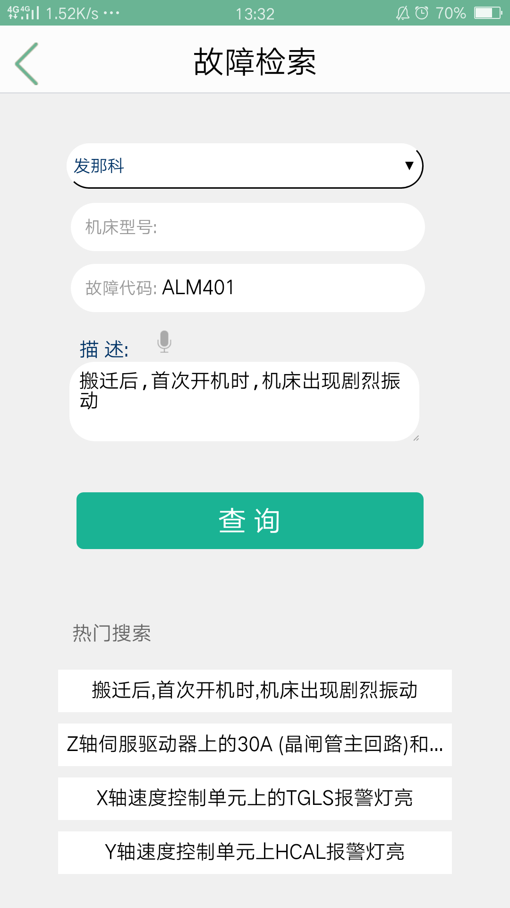
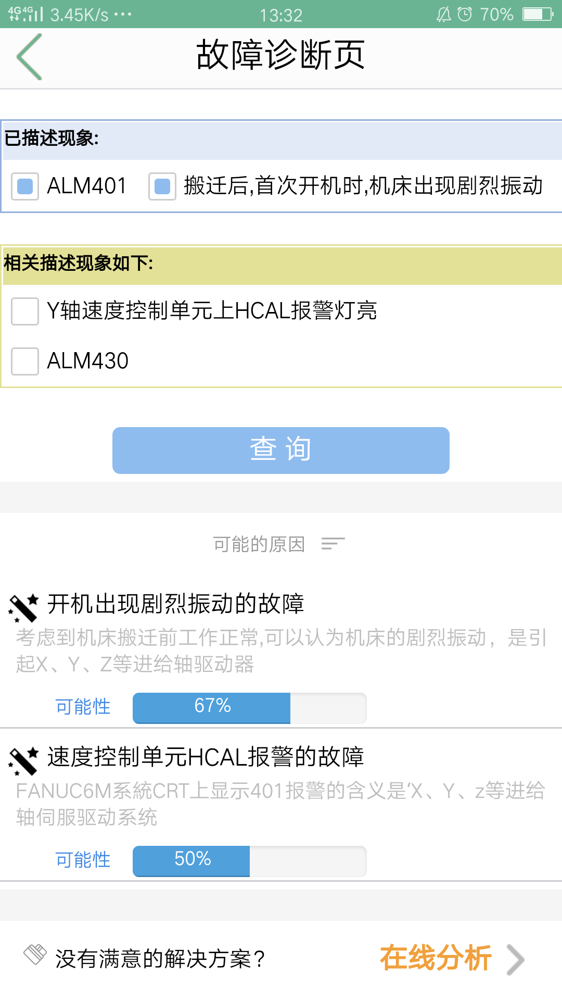
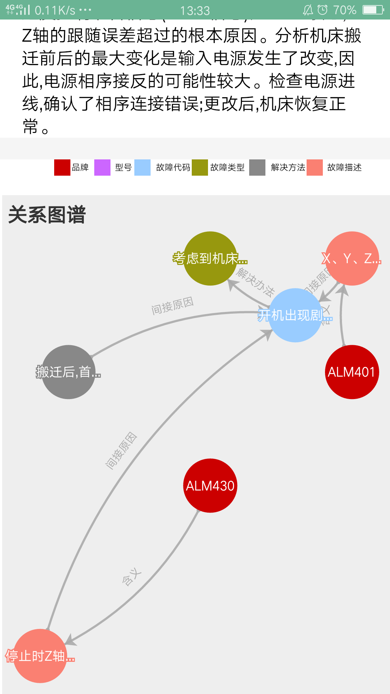
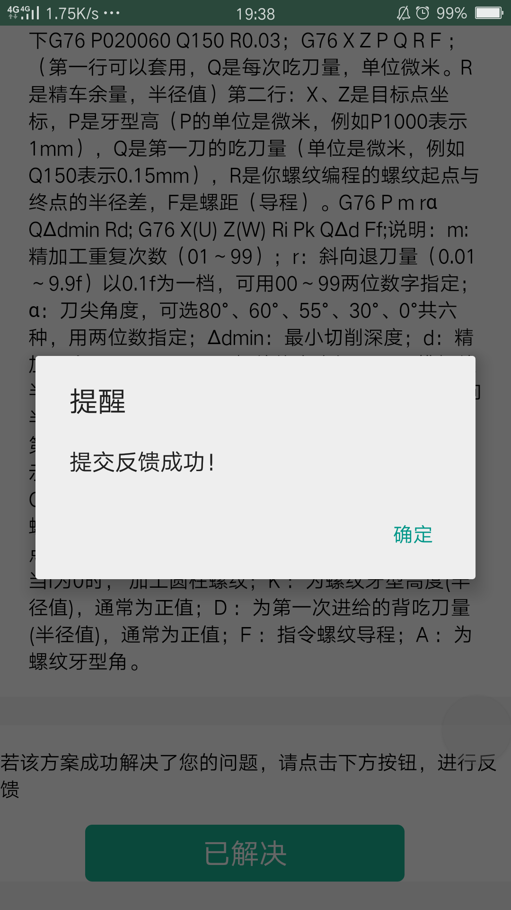
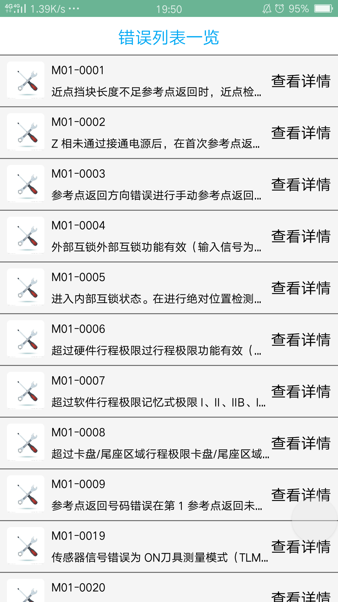

# ErrorPlatform
基于移动端在线设备故障诊断平台
 

   
技术：

HTML+Neo4j+NLP+Echarts+推理算法+WebMagic

   
(此项目为参加第八届软件杯的项目，未开源)

   
   
流程:通过python爬取了大量数控机床维修案例，使用MapReduce和NLP技术进行了数据清洗整理，基于Neo4j图数据库表故障属性之间的关联关系，使用推理算法进行推理。

   
系统主要有以下功能：

   

1.	基于知识图谱的规则推理诊断功能：
通过前面的介绍，我们从爬取的故障维修案例中提取出了品牌、故障现象等之间的关联关系，通过分析故障现象，系统会推理出相关的或隐藏的故障现象以及可能的原因，如果准确度不高，用户可以通过检查数控机床是否存在系统推荐的相关现象，如果有，选中提交再次进行推理。通过这种交互式的推理方式，提高了系统诊断的可靠性。

2.	在线爬取解决方案功能：
如果用户的故障超出了知识库的范围或用户对推理结果不满意，这时可以通过在线分析故障现象，爬取解决方案。
系统会按照解决方案的相关性和可靠性排序之后进行展示，除了爬取解决方案外，还会爬取相关连接，尽可能多的为用户的故障提供有帮助的信息。

3.	知识库自学习功能
如果用户对爬取的解决方案满意，系统会分析此次故障维修案例，完善知识库，下次再出现类似故障时，可以直接检索知识库，获得优质的解决方案。

页面展示:

  <h3 style="margin-left:100px">首页：</h3>
  
  <h3 style="margin-left:100px">问题输入：</h3>
     
  <h3 style="margin-left:100px"> 推理页：</h3>
  
  <h3 style="margin-left:100px">图谱页：</h3>
  
  <h3 style="margin-left:100px">反馈页：</h3>
  
  <h3 style="margin-left:100px">故障列表页：</h3>
  
  

  
  

   
   

